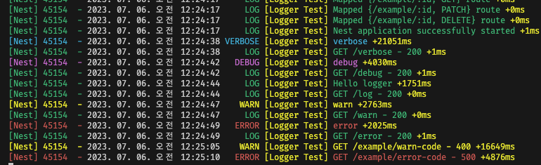

<p align="center">
  <a href="http://nestjs.com/" target="blank"></a>
</p>

[circleci-image]: https://img.shields.io/circleci/build/github/nestjs/nest/master?token=abc123def456
[circleci-url]: https://circleci.com/gh/nestjs/nest

  <p align="center">A progressive <a href="http://nodejs.org" target="_blank">Node.js</a> framework for building efficient and scalable server-side applications.</p>
  
## Install with npm or yarn

```
npm i @hoplin/nestjs-logger

yarn add @hoplin/nestjs-logger
```

## NestJS custom logger

Extended NestJS Logger, Based on NestJS common logger. Log messages also follow Nest embedded style

- Support logfile
- Able to use logger with Dependency Injection
- Compatible with existing logging module
- Global request flow

## How to Use?

1. Clone this repository

```
git clone https://github.com/J-hoplin1/NestJS-Custom-Logger.git

cd NestJS-Custom-Logger
```

2. Copy `logger` in root directory of repository.(or `src/logger`)
3. Paste to your NestJS Modules directory(which same as `src`)

## Start logger

To use this logger, you need to import `LoggerModule` to `app.module.ts` via `.forRoot()` method.

```typescript
import { LoggerModule } from '@hoplin/nestjs-logger';

@Module({
  imports: [
    LoggerModule.forRoot({
      applicationName: 'Logger Test',
      logfileDirectory: `${__dirname}/../`,
      saveAsFile: true,
      levelNTimestamp: {
        logLevels: ['log'],
        timestamp: true,
      },
    }),
  ],

...
```

`forRoot()` require some options. You can give two types of options, and each options refer to description under below

- `applicationName` - string
  - Name of application to be printed in the log message
- `saveAsFile` (optional) - boolean
  - `true` if you want to save log as logfile. **If it's `true`, option `logfileDirectory` is not optional**
- `logfileDirectory` (optional) - string
  - Directory where logfile will be saved.
- `levelNTimestamp`
  - `logLevels`(optional) - LogLevel[]
    - log level array. This work as same as NestJS Logger
  - `timestamp`(optional) - boolean
    - Check if logger print timestamp. `timestamp` mean, between current and previous log message.

For log level please refer json underbelow

```javascript
{
  verbose: 0,
  debug: 1,
  log: 2,
  warn: 3,
  error: 4,
};
```

after initialize logger with `.forRoot()`, You can import `LoggerModule` from other Moduels throgh `forFeature()` and make DI to Injectable object

```typescript
import { LoggerModule } from '@hoplin/nestjs-logger';

// example.module.ts
@Module({
  imports: [LoggerModule.forFeature()]

...
import { Logger } from '@hoplin/nestjs-logger';

// example.service.ts
@Injectable()
export class ExampleService {
  constructor(private readonly logger: Logger) {}
```

## Global request / response flow interceptor

If you want to log to console about every request, use [`FlowInterceptor`](./src/logger/logger.interceptor.ts). You can both register globally or you can use it with `@UseInterceptor()` decorator, which NestJS provide

```typescript
// main.ts
import { FlowInterceptor } from '@hoplin/nestjs-logger';

async function bootstrap() {
  const app = await NestFactory.create(AppModule);
  app.useGlobalInterceptors(new FlowInterceptor());
  ...
```

## Example Log Message

- Enable Flow Interceptor globally


